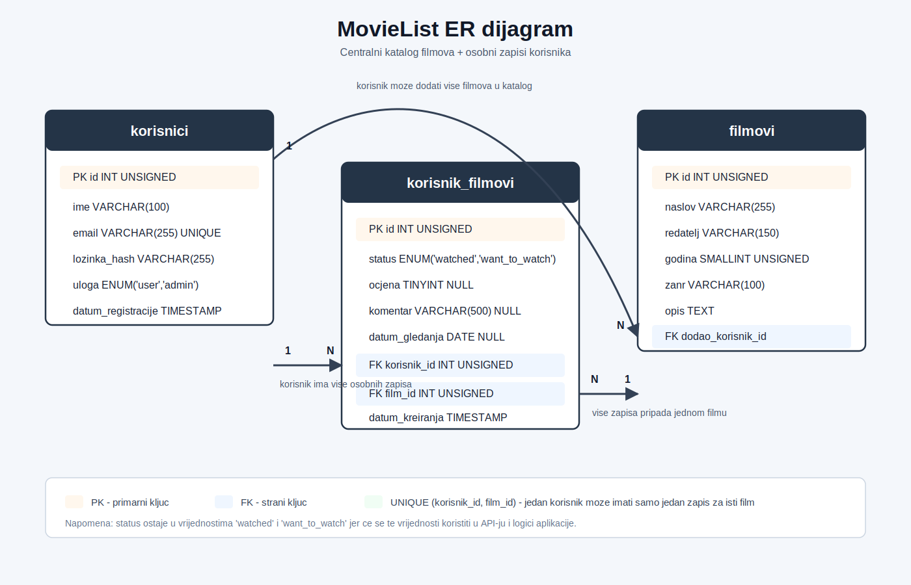

# MovieList

MovieList je web aplikacija za evidenciju filmova. Korisnici vode osobnu listu filmova koje su pogledali ili koje zele pogledati, uz mogucnost ocjenjivanja i pisanja kratkog komentara. Administrator upravlja centralnim katalogom filmova.

Projekt se izraduje prema zadatku iz kolegija Napredni razvoj web aplikacija, tema 7: MovieList.

## Tehnologije

- PHP
- MySQL
- Laragon lokalno razvojno okruzenje
- HTML, CSS i JavaScript

## Baza podataka

Naziv baze podataka: `movielist_db`

Glavni entiteti:

- `korisnici` - korisnici aplikacije
- `filmovi` - centralni katalog filmova
- `korisnik_filmovi` - osobni zapisi korisnika za pojedini film

Relacije:

- jedan korisnik moze dodati vise filmova u centralni katalog
- jedan korisnik moze imati vise osobnih zapisa u `korisnik_filmovi`
- jedan film moze biti povezan s vise korisnickih zapisa
- jedan korisnik moze imati samo jedan zapis po filmu

ER dijagram nalazi se u datoteci [docs/er-diagram.svg](docs/er-diagram.svg).



## Pokretanje baze u Laragonu

1. Pokrenuti Laragon.
2. Pokrenuti Apache i MySQL.
3. Otvoriti phpMyAdmin ili MySQL konzolu.
4. Izvrsiti SQL skriptu iz datoteke `database/schema.sql`.
5. Provjeriti da su kreirane tablice `korisnici`, `filmovi` i `korisnik_filmovi`.

## Konfiguracija spajanja na bazu

Primjer konfiguracije nalazi se u datoteci `.env.example`.

Za lokalni Laragon najcesce vrijednosti su:

```env
DB_HOST=localhost
DB_PORT=3306
DB_DATABASE=movielist_db
DB_USERNAME=root
DB_PASSWORD=
```

PHP konfiguracija za bazu nalazi se u datoteci `src/config/database.php`, a PDO konekcija u `src/config/Connection.php`. Prava `.env` datoteka ne ide na GitHub jer moze sadrzavati lokalne lozinke.

## MVC prikaz podataka

Korak 2 dodaje osnovnu MVC strukturu bez autentikacije. Aplikacija koristi demo korisnika s ID-em `1` za prikaz osobne liste.

Rute:

- `/movies` - katalog svih filmova s prosjecnim ocjenama
- `/movies/{id}` - detalji filma s prosjecnom ocjenom
- `/my-list` - osobna lista demo korisnika, odvojena na `watched` i `want_to_watch`

Za Laragon je preporuceno postaviti document root na `public/` folder projekta. Ako se koristi Apache virtual host, `.htaccess` u `public/` folderu preusmjerava rute na `public/index.php`.

## Struktura projekta

```text
MovieList/
├── database/
│   └── schema.sql
├── docs/
│   ├── er-diagram.mmd
│   ├── er-diagram.svg
│   └── adr/
│       └── ADR-001.md
├── .env.example
├── public/
│   ├── .htaccess
│   ├── index.php
│   └── styles.css
├── src/
│   ├── config/
│   │   ├── Connection.php
│   │   └── database.php
│   ├── controllers/
│   │   ├── MovieController.php
│   │   └── UserMovieController.php
│   ├── models/
│   │   ├── MovieModel.php
│   │   └── UserMovieModel.php
│   ├── views/
│   ├── Router.php
│   └── helpers.php
└── README.md
```

## Trenutni status

Implementirani su Korak 1 i Korak 2:

- inicijaliziran Git repozitorij
- dodana osnovna struktura projekta
- dodana SQL skripta za kreiranje baze i tablica
- definiran ER dijagram za `korisnici`, `filmovi` i `korisnik_filmovi`
- definirane relacije i ogranicenja baze
- dodano UNIQUE ogranicenje za jedan korisnicki zapis po filmu
- dodani pocetni testni filmovi u centralni katalog
- dodan ADR-001 zapis
- dodana Router klasa
- dodani modeli `MovieModel` i `UserMovieModel`
- dodani controlleri `MovieController` i `UserMovieController`
- dodani viewevi za katalog filmova, detalje filma i osobnu listu korisnika
